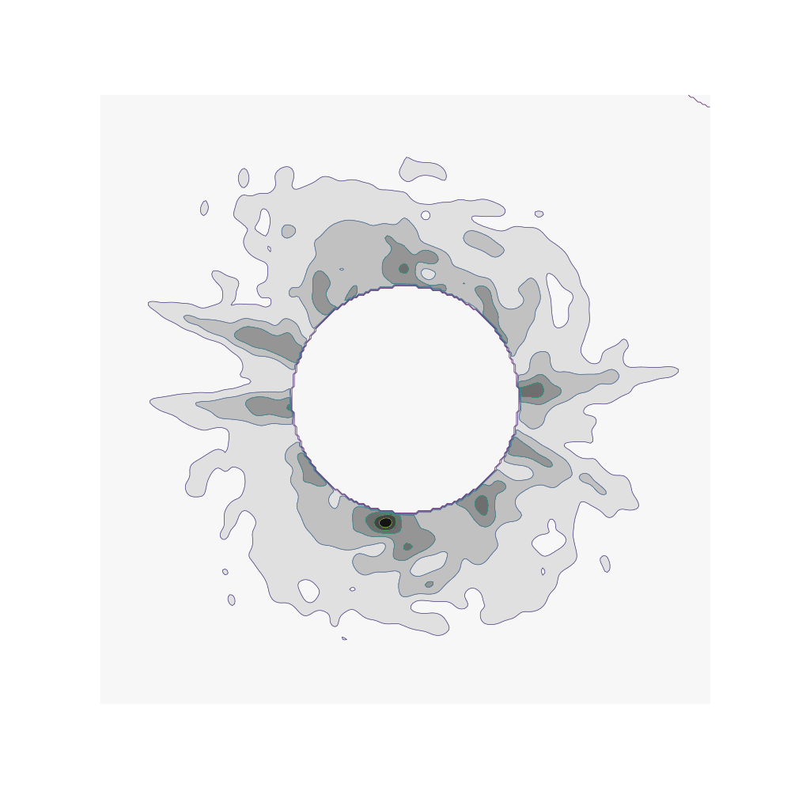

## Robust Symmetry Detection with Riemannian Langevin Dynamics
### SIGGRAPH ASIA 2024 [[📖 Paper](https://arxiv.org/abs/2410.02786)] [[🚀 Project Page](https://symmetry-langevin.github.io/)] [[⭐ Colab Demo](https://colab.research.google.com/drive/1mzytIuqjgIj2D_K3VTt-qhMtluVdVBGg?usp=sharing)] 
> #### Authors &emsp;&emsp; [Jihyeon Je](https://jihyeonje.com/)<sup>1*</sup>, [Jiayi Liu]()<sup>1*</sup>, [Guandao Yang](https://www.guandaoyang.com/)<sup>1*</sup>, [Boyang Deng](https://boyangdeng.com/)<sup>1*</sup>, [Shengqu Cai](https://primecai.github.io/)<sup>1</sup>, [Gordon Wetzstein](https://stanford.edu/~gordonwz/)<sup>1</sup>, [Or Litany](https://orlitany.github.io/)<sup>2</sup>, [Leonidas Guibas](https://geometry.stanford.edu/)<sup>1</sup> <br> <sub> &emsp;&emsp;&emsp;&emsp;&emsp;&emsp;&emsp;&emsp; <sup>1</sup>Stanford University, <sup>2</sup>Technion </sub><br><br>


## Setup
First, download and set up the repo:
```bash
git clone https://github.com/Jihyeon-Je/neural-symmetry.git
cd neural-symmetry
```
You will also need to install Jax, open3d, trimesh, as well as Blender for visualization.


## Running parameter sweep for langevin
Modifying each of these parameters will impact the langevin walk result. We suggest that you tune sigma, n_samples, and n_steps depending on compute resource / data (Generally, larger n_samples, n_steps will lead to longer runtime, and a smaller sigma will let you pick up smaller symmetries but might also introduce some noise). 

```bash
# see the lits of arguments for more detail
python 2d_sweep.py --sigma SIGMA --R R --stepe_size STEP --n_steps num_steps --n_samples num_initial_samples --n_points num_noise_points
python 3d_sweep.py --sigma [0.1,0.08,0.05,0.03] --n_samples 1_000_000 --n_steps [10_000, 30_000, 60_000] --output OUTPUTPATH --data_path DATAPATH
```

### Or, if you directly know which parameters to use: 
```bash
python 2d_langevin.py --data_path ./temp_test/shapes --out_path ./temp_test/output --num_runs 1 --num_skip 0 --gen_vid True --step_size 0.06 --sigma 0.025
python 3d_sweep.py --sigma 0.08 --n_samples 1_000_000 --n_steps 10_000 --output OUTPUTPATH --data_path DATAPATH
```


## Running Blender visualization
If you want to visualize the output of the Langevin dynamics, please see the visualization notebook:
```
visualize_3d_planes.ipynb
```

To render with blender:
```bash
#you will have to preprocess the langevin outputs before you run blender visualization. 
python blender_visualization/render_mesh.py
```
---

#### BibTeX
```
@inproceedings{10.1145/3680528.3687682,
author = {Je, Jihyeon and Liu, Jiayi and Yang, Guandao and Deng, Boyang and Cai, Shengqu and Wetzstein, Gordon and Litany, Or and Guibas, Leonidas},
title = {Robust Symmetry Detection via Riemannian Langevin Dynamics},
year = {2024},
isbn = {9798400711312},
publisher = {Association for Computing Machinery},
address = {New York, NY, USA},
url = {https://doi.org/10.1145/3680528.3687682},
doi = {10.1145/3680528.3687682},
booktitle = {SIGGRAPH Asia 2024 Conference Papers},
articleno = {91},
numpages = {11},
keywords = {Geometry Processing, Generative Modeling, Langevin Dynamics},
location = {Tokyo, Japan},
series = {SA '24}
}


```